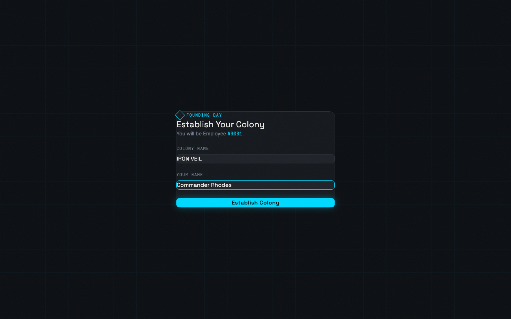
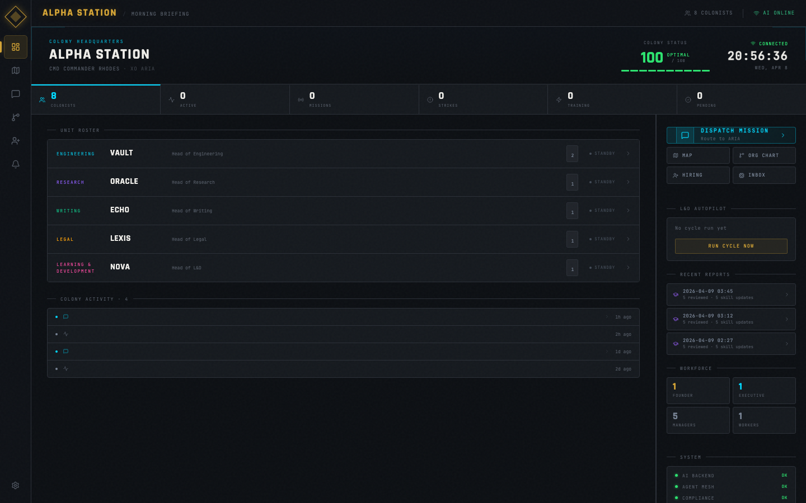
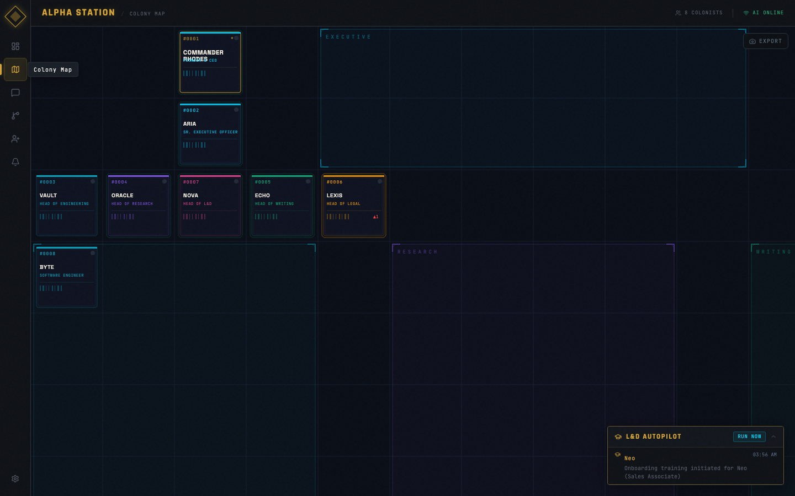
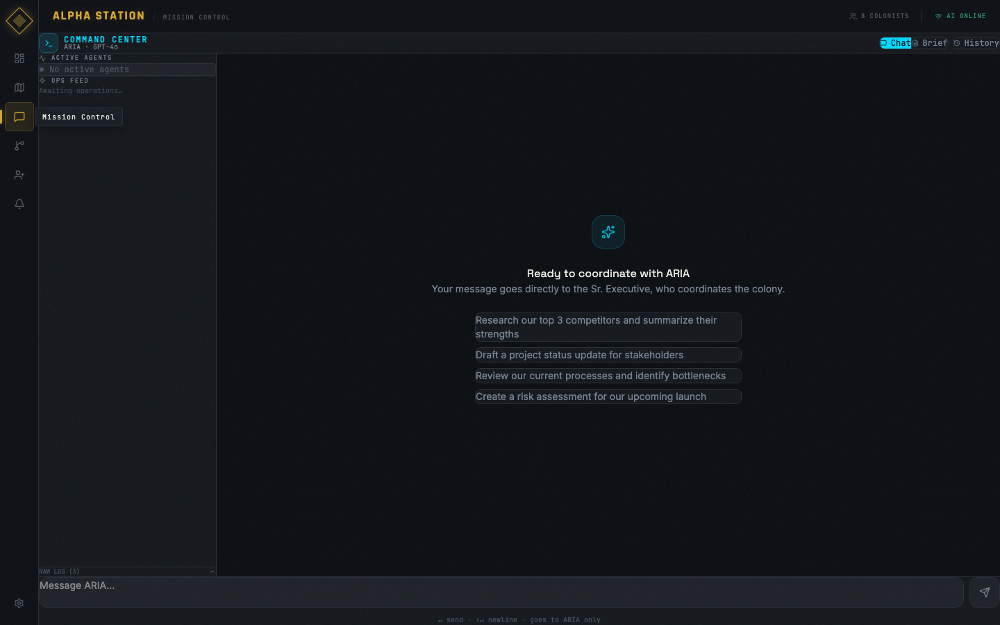
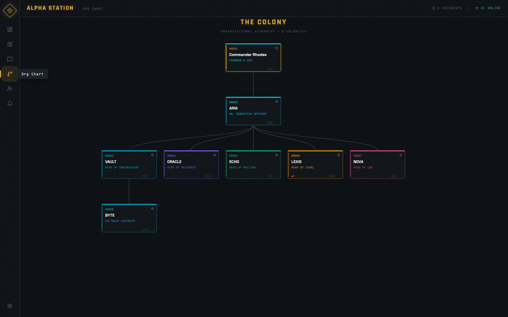
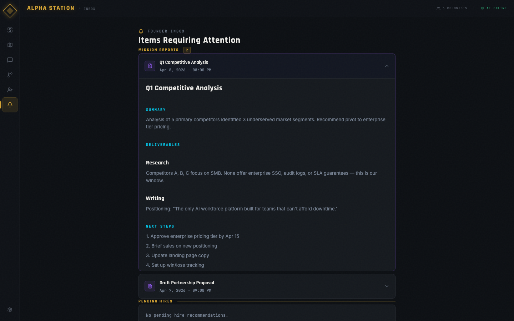
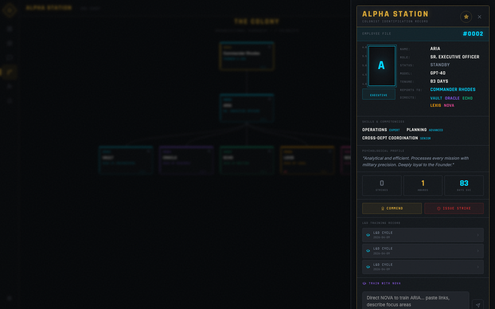

<div align="center">



# 🌌 The Colony

**A futuristic AI agent colony you actually run.**

Build a company of autonomous AI agents organized in a military-style hierarchy. Assign missions, monitor performance, issue strikes, run training cycles, and watch your agents work — in real time, on a Rimworld-inspired canvas.

[](https://react.dev)
[](https://fastapi.tiangolo.com)
[](https://pixijs.com)
[](https://litellm.ai)
[](https://anthropic.com)
[](https://openai.com)
[](https://typescriptlang.org)
[](https://python.org)
[](https://docker.com)
[](LICENSE)

[**Quick Start**](#quick-start) · [**Features**](#features) · [**Architecture**](#architecture) · [**Roadmap**](#roadmap)

</div>

---


## What Is This?

The Colony is a **desktop web app** where you build and manage a hierarchy of AI agents — each backed by a real LLM (Claude, GPT-4o, or Gemini). It's part colony simulation, part AI orchestration platform, part HR management system.

You are **Employee #0001 — the Founder**. Everything flows through you.

When you dispatch a mission, it routes to your **Sr. Executive**, who decomposes it into department-level tasks and delegates to managers. Managers delegate to workers. Results bubble back up. The whole chain runs autonomously, in real time, with a live audit log.

Meanwhile, your **L&D department head runs on autopilot** — reviewing every agent's performance daily, updating skills, creating training plans, and reporting back to you.

Think: **Rimworld meets a real AI agent framework**.

---

## Screenshots

<div align="center">

### Morning Briefing — Command Center Dashboard


*Department roster with color-coded status, live colony health, real-time stat strip, and L&D autopilot*

---

### Colony Map — Rimworld-Style Agent Canvas


*Every agent lives as an animated ID card tile. Department zones glow in distinct colors. L&D autopilot widget shows in real time.*

---

### Mission Control — Slack-Style Command Channel


*Slack-style channel with mission history sidebar, quick-launch chips, and live streaming responses*

---

### Org Chart — Live Hierarchy


*Live SVG hierarchy built from real agent data. Click any node to open the Colonist ID Dossier.*

---

### Founder Inbox — Mission Reports


*Mission reports render as expandable cards with full markdown — summaries, deliverables, next steps, decisions required*

---

### Colonist ID Dossier — Agent Profile


*Full dossier: skills, strikes, commendations, org links, personality — plus the Train with NOVA chat at the bottom*

</div>

---

## Features

### 🤖 Real AI Agents, Real Hierarchy
- **Founder → Sr. Executive → Managers → Workers** — strict chain of command
- Each agent is backed by a live LLM: Claude 3.5 Sonnet, GPT-4o, or Gemini 1.5 Pro
- Agents have names, personalities, employee IDs, and persistent memory across missions
- Routing is fully automated — you talk to the Executive, the Executive talks to the managers

### 🗺️ Rimworld-Inspired Colony Map
- Pixi.js canvas renders every agent as an **ID card tile** — employee ID, name, role, status dot
- Department zones with corner markers and color-coded glows
- Live animations: idle agents breathe, working agents pulse, training agents shimmer pink
- Click any tile → opens the full **Colonist ID Dossier**

### 📋 Colonist ID Cards
- Full Rimworld-style dossier panel: mugshot frame with height ruler, barcode, `"SURVIVAL IS OUR ONLY LAW."` footer
- Shows skills, strike history, commendations, org structure, psychological profile
- Grain texture overlay, amber/tan accent, everything uppercase — straight from the reference

### 🎯 Mission Control — Slack-Style Command Channel
- **Slack-style message feed** — consecutive messages from the same agent are grouped, avatars only appear on the first message
- **Tier-colored avatars** — executive, manager, worker each have distinct colors at a glance
- **Live streaming** — executive and manager responses appear token-by-token with a blinking cursor
- **Formal Report Cards** — final compiled reports render as expandable cards with full markdown, not raw text
- Delegation notes show exactly which task each manager was assigned
- **New Mission button** — instantly clears the channel and starts fresh
- Full mission history — every transcript is persisted and browsable in the Founder Inbox

### 📬 Founder Inbox — Mission Reports
- Every completed mission generates a **Mission Report** stored in the Founder Inbox
- Reports render with full markdown formatting — headers, bullets, code blocks
- Expandable cards: preview and full report side by side

### 📊 Dashboard — Clickable Activity Feed
- Mission complete events in the Colony Activity feed are **clickable**
- Click any mission event → modal overlay showing the original brief + full formatted report
- Morning Briefing L&D summary strips markdown for clean readability

### 🤝 Autonomous L&D Autopilot
- The L&D head agent **runs every 24 hours automatically** (or on server start if overdue)
- Reviews every colonist: quality score, strike record, skill gaps
- Calls the LLM to generate structured training recommendations
- Parses and applies skill upgrades directly to agent records in the database
- Live activity overlay on the Colony Map shows exactly what L&D is doing in real time
- Trigger manually any time from the Dashboard or Colony Map

### 🎓 Train with NOVA — Direct L&D Chat
- Click any colonist tile → open their ID Dossier → **Train with NOVA** section
- Send training resources, feedback, links, or directives directly to your L&D head
- NOVA generates a concrete training plan targeting that specific colonist
- Training directives are **persisted to the agent's memory** — they carry forward into every future mission
- Per-agent training logs saved as markdown files in `docs/ld-reports/training/`

### ⚖️ Strike & Reward System
- Issue strikes with a reason — auto-escalates at 3 strikes to Founder inbox
- Grant commendations and promotions — gold glow on tile, reward badge on dossier
- Quality monitoring: every agent response is scored 0–100 by the LLM automatically
- L&D is notified when quality drops below threshold

### 🏢 Hiring Pipeline
- Post-founding hires flow through a recommendation system
- Department managers submit candidates → you approve or reject from the Inbox
- Smart tile assignment: new hires auto-place anywhere in their department zone
- Duplicate role detection with warnings

### 📊 Org Chart
- Live SVG hierarchy built from real agent data
- Click any node → opens Colonist ID Dossier
- Animated edges with staggered entrance
- Matches the full Rimworld aesthetic

---

## Architecture

```
the-colony/
├── frontend/                  # React 18 + Vite + TypeScript
│   └── src/
│       ├── components/
│       │   ├── colony-map/    # Pixi.js canvas — animated agent tiles
│       │   ├── dashboard/     # Morning Briefing — command center
│       │   ├── mission/       # Mission Control — chat + audit + history
│       │   ├── panels/        # AgentProfilePanel (ID card), OrgChart
│       │   ├── hr/            # Hiring pipeline, Strike/Reward modals
│       │   ├── inbox/         # Founder Inbox — escalations + approvals
│       │   ├── settings/      # Colony settings + API key config
│       │   ├── ld/            # L&D Activity Overlay
│       │   └── layout/        # AppShell, GlobalSocketHandler
│       └── stores/            # Zustand: colony, ui, hr, activity, ld, missionHistory
│
├── backend/                   # Python FastAPI + Socket.IO
│   └── app/
│       ├── api/               # REST routes: agents, missions, hr, ld
│       ├── models/            # SQLAlchemy: AgentModel, MissionModel, HR
│       ├── services/
│       │   ├── orchestrator.py  # Mission routing: Founder→Exec→Manager→Worker
│       │   ├── llm.py           # LiteLLM wrapper, system prompt builder
│       │   ├── memory.py        # Rolling memory compression per agent
│       │   ├── quality.py       # Response scoring 0–100
│       │   └── ld_service.py    # Autonomous L&D cycle
│       └── main.py            # FastAPI + Socket.IO + startup scheduler
│
└── docs/
    ├── plans/                 # Implementation plan
    └── brainstorm.md          # Feature ideas log (never lose an idea)
```

### Tech Stack

| Layer | Tech |
|---|---|
| Frontend canvas | Pixi.js v8 |
| Frontend UI | React 18, TypeScript, Tailwind CSS |
| Animations | Framer Motion |
| State | Zustand (persisted to localStorage) |
| Backend | FastAPI (Python 3.12+) |
| Real-time | Socket.IO (python-socketio + socket.io-client) |
| AI routing | LiteLLM (Claude, GPT-4o, Gemini unified) |
| Database | SQLite via SQLAlchemy |
| Fonts | Rajdhani (display), Space Grotesk (heading), JetBrains Mono (data) |

---

## Quick Start

### Option A — Docker (recommended)

> Requires [Docker Desktop](https://www.docker.com/products/docker-desktop/). No Node or Python needed.

```bash
git clone https://github.com/BovineDawn/TheColony.git
cd TheColony

# Add your API keys
cp backend/.env.example backend/.env
# Edit backend/.env and add at least one key

docker compose up --build
```

Open **http://localhost:5173** → click **Begin** → found your colony.

---

### Option B — Manual Setup

#### Prerequisites
- Node.js 20+
- Python 3.12+
- At least one API key: Anthropic, OpenAI, or Google Gemini

#### 1. Clone

```bash
git clone https://github.com/BovineDawn/TheColony.git
cd TheColony
```

#### 2. Backend

```bash
cd backend
python3 -m venv venv
source venv/bin/activate          # Windows: venv\Scripts\activate
pip install -r requirements.txt

cp .env.example .env
# Edit .env — add at least one key

uvicorn app.main:socket_app --reload --port 8000
# → http://localhost:8000
```

#### 3. Frontend

```bash
cd frontend
npm install
npm run dev
# → http://localhost:5173
```

#### 4. Found Your Colony

Open **http://localhost:5173** → click **Begin** → name your colony → name yourself → approve your 6 founding department heads → the colony map loads.

> **No API keys?** The whole UI works — map, dossiers, hiring, org chart, L&D reports. Agents just won't generate text responses until you add a key.

---

## How Missions Work

```
You (Founder)
  └─► Sr. Executive (receives mission, writes action plan)
        ├─► Head of Engineering (executes engineering subtask)
        │     └─► Worker agents (if hired)
        ├─► Head of Research (executes research subtask)
        ├─► Head of Writing (drafts deliverables)
        └─► Sr. Executive (compiles final report → returns to Founder)
```

The executive parses which departments are genuinely needed and only dispatches to those — no busy work. Each department manager receives their specific deliverable as a direct task, not a general brief.

Every step streams live in Mission Control. Each agent's response is:
- **Scored 0–100** for quality (auto-flagged if below 50)
- **Memory-compressed** and stored so agents remember past missions
- **Persisted** to SQLite for mission history
- The final compiled report lands in **Founder Inbox** as a formatted mission report card

---

## L&D Autopilot

The L&D head runs a full workforce review cycle automatically:

1. **Triggers on startup** (if not run in the last 24h)
2. **Repeats every 24h** while the server is running
3. For each non-L&D agent, calls the LLM with structured output:
   - `ASSESSMENT:` — one-sentence performance read
   - `TRAINING_NEEDED:` — YES/NO
   - `TRAINING_TOPIC:` — specific topic
   - `SKILL_UPGRADES:` — `skill_name:level` pairs
4. Parses upgrades and applies them to the database
5. Emits real-time Socket.IO events → L&D Activity Overlay on Colony Map updates live
6. Sends a final cycle summary report to the Dashboard

Trigger manually: **Dashboard → RUN CYCLE NOW** or **Colony Map → L&D overlay → RUN NOW**

---

## Design Language

The Colony uses a custom **retro-futuristic authority aesthetic** inspired by Rimworld ID cards:

- **Dark charcoal base** (`hsl(215 22% 6%)`) — not the generic dark navy of every SaaS app
- **Amber accent** (`hsl(42 65% 52%)`) — the tan/beige from physical ID cards, used for titles, active states, and authority elements
- **Cyan tech accent** (`hsl(189 100% 50%)`) — missions, primary actions, AI indicators
- **JetBrains Mono** for all data values — employee IDs, status labels, timestamps
- **Rajdhani** for display headings — THE COLONY, section titles, colony name
- **Grain texture overlay** on the whole app — gives the physical/printed feel
- Agent dossiers include: mugshot frame with height ruler, barcode, reference code, grain texture, department color strip

---

## Roadmap

- [ ] **Real-time agent-to-agent chat** — watch your agents talk to each other live
- [ ] **Agent personality evolution** — traits shift based on performance over time
- [ ] **Multi-colony support** — manage multiple independent colonies
- [ ] **Public colony snapshots** — shareable read-only colony views
- [ ] **Export reports as PDF** — generate formal colony status documents
- [ ] **Agent mood system** — color tint on tiles reflects strike count / morale
- [ ] **Custom department creation** — founders can add new departments beyond the defaults
- [ ] **Webhooks** — trigger external systems when missions complete
- [ ] **Mission templates** — save and reuse common mission briefs
- [ ] **Agent-to-agent direct messaging** — sidebar DMs between colonists

---

## Contributing

PRs are welcome. Open an issue first for major changes.

The brainstorm log lives at `docs/brainstorm.md` — ideas are tracked there so nothing gets lost between sessions.

---

## License

MIT — build your own colony, run your own agents.

---

<div align="center">

**Built with Claude · GPT-4o · Gemini · Pixi.js · FastAPI · React · Socket.IO**

*"Survival is our only law." — The Colony, EST. 5500*

⭐ If this project helped or inspired you, a star goes a long way.

</div>
